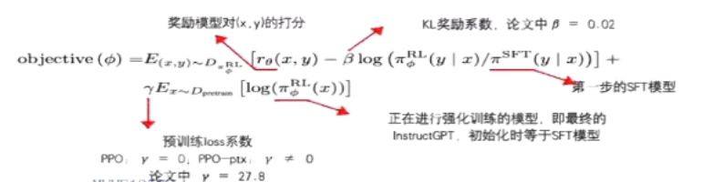
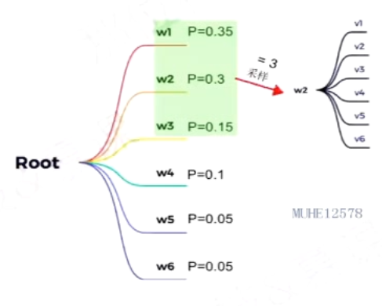
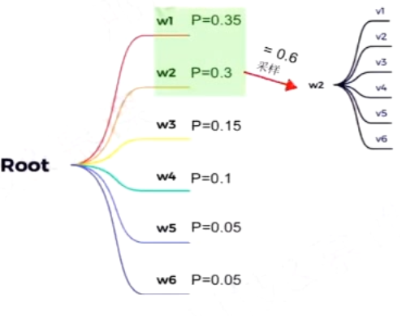
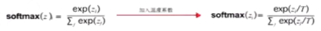
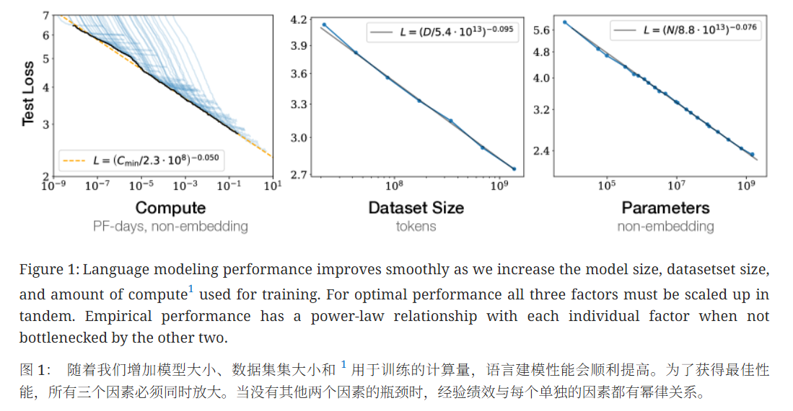

## 概述

`基本Pipeline：问题明确->数据获取->数据清理->数据探索->数据准备->训练模型->微调模型->结果应用->监控迭代`

### 整体视角

- 数据决定算法的上线，模型只是去逼近这个上线
- 算法工程师的基础能力：数据采集、评估、传输、预处理、标注、分析、挖掘、特征融合等

### LLM构建流程

|          | 预训练                                             | 有监督微调                                       | 奖励建模                                 | 强化学习                             |
| -------- | -------------------------------------------------- | ------------------------------------------------ | ---------------------------------------- | ------------------------------------ |
| 数据集合 | 原始数据 [==数千亿==单词：图书、百科、网页等] | 标注用户指令 [==数万==用户指令和对应的答案] | 标注对比对 [==数万量级==标注对比对] | 用户指令 [==十万量级==用户指令] |
| 算法     | 语言模型训练                                       | 语言模型训练                                     | 二分类模型                               | 强化学习方法                         |
| 模型     | 基础模型                                           | SFT模型                                          | RM模型                                   | RL模型                               |
| 资源需求 | 1000+GPU[月]                                       | 1-100GPU[天]                                     | 1-100GPU[天]                             | 1-100GPU[天]                         |

**有监督微调：**

`指令微调(Instruction Tuning)利用少量高质量数据集合，包含用户输入的提示词(Prompt)和对应的理想输出结果。用户输入包括问题、闲聊对话、任务指令等多种形式和任务`

- 如何微调？利用高质量有监督数据，使用与训练阶段相同的语言模型训练算法，在基础语言模型基础上再训练，得到有监督微调模型(SFT模型)
- 微调后的效果：具备初步指令理解能力和上下文理解能力，能够完成开放领域问题、阅读理解、翻译、生成代码等能力，也具备一定对未知任务的泛化能力

**下游任务微调：**

`DownstreamTaskFine-tuning`

目的：在通用语义表示基础上，根据下游任务的特性进行适配

注意：容易使得模型遗忘预训练阶段学习到的通用语义知识表示，损失模型的通用性和泛化能力，造成灾难性遗忘(CatastrophicForgetting)问题，因此通常采用混合预训练任务损失和下游微调损失的方法来缓解

**奖励建模：**

`Reward Modeling`

目的：构建一个文本质量对比模型，对于同一个提示词，SFT模型给出的多个不同输出结果的质量进行排序

注意：RM模型的准确率对于强化学习阶段的效果有至关重要的影响，因此需要大规模训练数据

**强化学习：**

`Reinforcement Learning`

流程：根据数十万用户给出的提示词，利用在前一阶段训练的RM模型，给出CFT模型对用户提示词补全结果的质量评估，并与语言模型建模目标综合得到更好效果

该阶段使得基础模型的熵降低，会减少模型输出的多样性

1. 从数据集中sample一个prompt
2. 语言模型(policy)生成输出
3. 使用奖励模型(Environment)计算得分$r\theta(x,y)$(Reward)由$r\theta(x,y)$使用PPO-ptx算法优化语言模型

### LLM参数

#### 采样系数Top-k

`如何预测下一个词`

> 在某一解码时间步，固定选取前k个概率对应的词作为候选，并按照概率进行采样
>
> 采样并不代表每次都会选概率最大的，只是概率越大被选中的几率越大

**top-k值对解码效果影响：**

- k值变大：选择范围变大，输出更加多样化但精确度也会降低
- k值变小：输出更加确定但缺乏多样性

**缺点：**

- 不会更具词的概率分布动态调整k值

#### 采样系数Top-p

> 解决了Top-k采样中只能固定选取前k个词的问题
>
> 在某一解码时间步，动态选取概率之和大于p的最小集合作为候选，并按照概率进行采样

**给定p值时，候选词列表的大小主要由概率分布决定：**

- 如果模型对下一个词比较确定，则候选词列表会比较小
- 反之，概率分布会相对均匀(对下一个词不确定)，此时候选列表会相对大一些

**实际应用：**

- 将`Top-k`和`Top-p`方法进行结合，先应用`Top-k`，然后应用`Top-p`

#### 温度系数Temperature

`控制了softmax输出分布，Temperature=1时退化为标准softmax函数`

**Temperature对输出结果的影响：**

- 当Temperature较低时(如0.1/0.2)：模型倾向于选择概率较高的单词，生成的文本较为连贯和准确，但可能显得过于保守，缺乏创造性和多样性
- 当Temperature较高时(如0.8/1.0)：模型倾向于选择概率较低的单词，生成的文本较为多样和创造，但可能牺牲了一定的连贯性和准确性

**应用技巧：**

- LLM中普遍取值一般为0.2~1.0
- 对于多样性要求较高的任务(例如对话、文本生成)可适当提高温度系数

### 预训练模型分类

#### NLU类

`自然语言理解`

- 以`BERT`为代表的自编码预训练模型，NLU任务：分配、抽取等
- 如何训练？借助特定的预训练任务进行学习，如：掩码语言模型(MLM)、下一个句子预测(NSP)等
- 双向语言模型，同时建模上文和下文信息
- 代表模型：RoBERTa、ALBERT、ELECTRA、DeBERTa等
- NLU任务特点：输出范围确定、评价方法相对明确

#### NLG类

`自然语言生成`

- 以`GPT`为代表的自回归预训练模型，NLG任务：文本生成、生成式摘要、对话等
- 如何训练？使用Causal LM训练(N-gram语言模型的自然延申)，无需设计复杂的预训练任务
- 单向语言模型，部分模型采用双向编码器和单向编码器结构
- 代表模型：GPT系列(Decoder-only)、T5和BART(Encoder-Decoder)等
- NLG任务特点：输出自由度搞、评价方法较难、更具有创造性

### 模型的涌现能力

`《Emergent Abilities of Large Language Models》`

#### 基于模型放大

- TruthfulQA：当模型放大至280B，其效果会突然高于随机20%
- Multi-task language understanding：当训练计算量达到70B-280B后效果将远远超过随机
- Word in Context：当PaLM被缩放至540B时，高于随机的效果出现

根据文章：`Scaling Laws` for Neural Language Models

#### 基于样例提示

通过 few-shot prompting来执行任务的能力也是一种涌现现象

