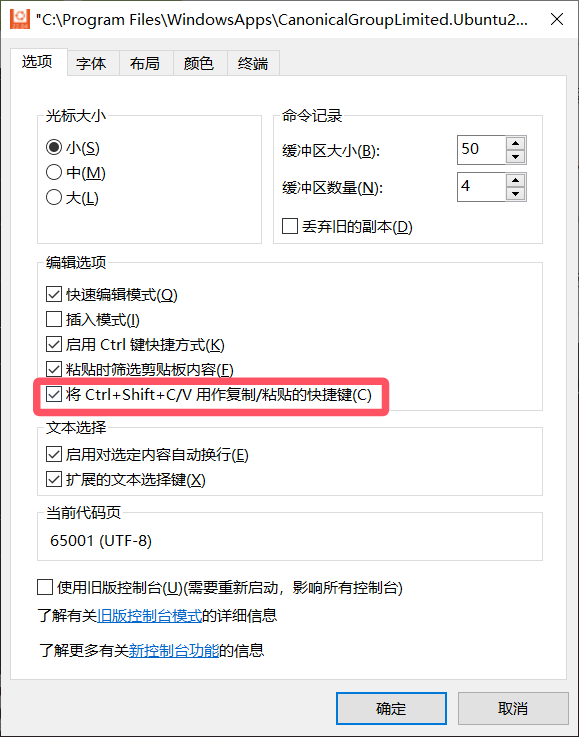

> WSL说明文档：https://learn.microsoft.com/zh-cn/windows/wsl/
>
> 你想搞的话，也就只需要：
>
> 1. 电脑换成win10专业版
> 2. 配置wsl
> 3. 配置ubuntu
> 4. 装驱动
> 5. pycharm解释器配置

## Wsl内核

### 要求

系统：windows10专业版

### wsl内核安装

```bash
wsl --install
```

### wsl2内核安装

微软WSL官网 [https://learn.microsoft.com/zh-cn/windows/wsl/install-manual#step-4---download-the-linux-kernel-update-package](https://link.zhihu.com/?target=https%3A//learn.microsoft.com/zh-cn/windows/wsl/install-manual%23step-4---download-the-linux-kernel-update-package)

内核下载地址：[https://wslstorestorage.blob.core.windows.net/wslblob/wsl_update_x64.msi](https://link.zhihu.com/?target=https%3A//wslstorestorage.blob.core.windows.net/wslblob/wsl_update_x64.msi)

下载后直接双击安装

### 设置wsl版本

```bash
wsl -l -v		# 正在运行的wsl版本
wsl --set-default-version 2		# 设置使用的wsl版本为wsl2
```

## Windows功能开启

`启动或关闭Windows功能`

1. Hyper-V
2. 适用于linux的windows子系统
3. 虚拟机平台（wsl2基于此）

## Microsoft安装ubuntu

安装完配置一下用户

## 细节设置


